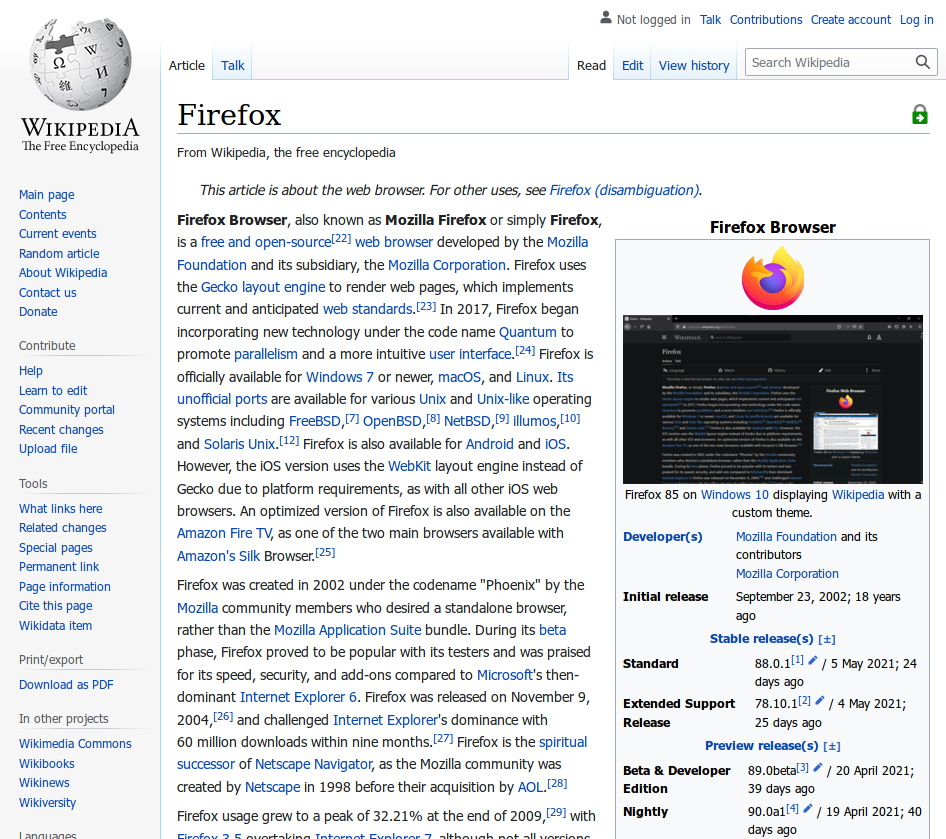
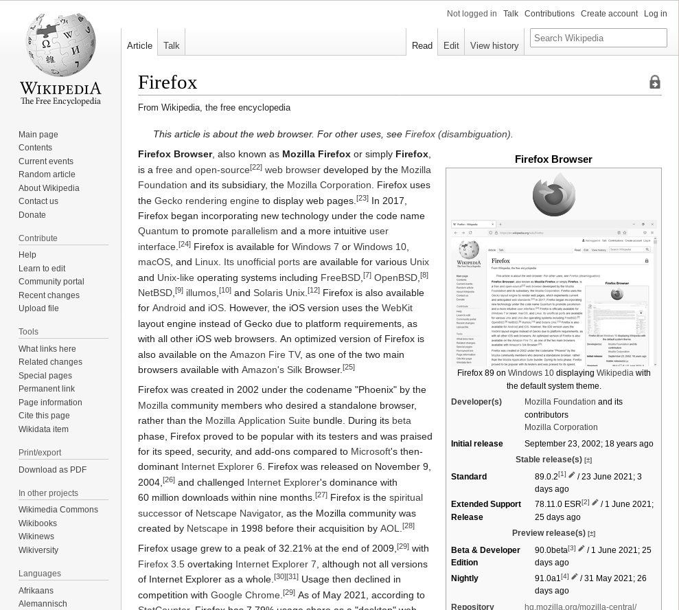
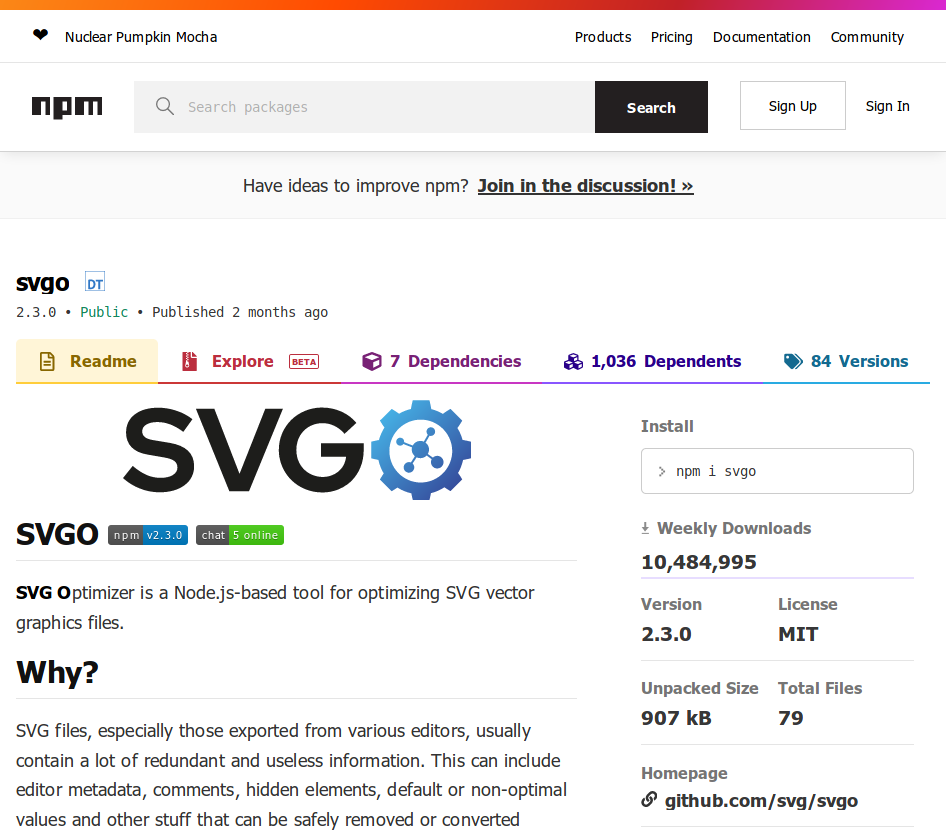

=  HyperFiler

++++

<i>Bundle web pages into single standalone HTML files.</i>

++++

==  Table of Contents

++++

  &nbsp;•&nbsp;<a href="#overview">Overview</a> 

  &nbsp;•&nbsp;<a href="#basic_usage">Basic Usage</a> 

  &nbsp;•&nbsp;<a href="#installation">Installation</a> 

  &nbsp;&nbsp;&nbsp;&nbsp;&nbsp;◦&nbsp;<a href="#installation_npm">NPM</a> 

  &nbsp;&nbsp;&nbsp;&nbsp;&nbsp;◦&nbsp;<a href="#installation_windows">Windows</a> 

  &nbsp;&nbsp;&nbsp;&nbsp;&nbsp;◦&nbsp;<a href="#installation_mac">Mac</a> 

  &nbsp;&nbsp;&nbsp;&nbsp;&nbsp;◦&nbsp;<a href="#installation_linux">Linux</a> 

  &nbsp;&nbsp;&nbsp;&nbsp;&nbsp;&nbsp;&nbsp;&nbsp;&nbsp;▪&nbsp;<a href="#installation_debian_ubuntu">Debian and Ubuntu-based distributions</a> 

  &nbsp;&nbsp;&nbsp;&nbsp;&nbsp;&nbsp;&nbsp;&nbsp;&nbsp;▪&nbsp;<a href="#installation_fedora">Fedora</a> 

  &nbsp;&nbsp;&nbsp;&nbsp;&nbsp;&nbsp;&nbsp;&nbsp;&nbsp;▪&nbsp;<a href="#installation_arch">Arch Linux-based</a> 

  &nbsp;&nbsp;&nbsp;&nbsp;&nbsp;◦&nbsp;<a href="#installation_bsd">BSD</a> 

  &nbsp;&nbsp;&nbsp;&nbsp;&nbsp;&nbsp;&nbsp;&nbsp;&nbsp;▪&nbsp;<a href="#installation_freebsd">FreeBSD</a> 

  &nbsp;&nbsp;&nbsp;&nbsp;&nbsp;&nbsp;&nbsp;&nbsp;&nbsp;▪&nbsp;<a href="#installation_openbsd">OpenBSD</a> 

  &nbsp;&nbsp;&nbsp;&nbsp;&nbsp;◦&nbsp;<a href="#installation_haiku">Haiku</a> 

  &nbsp;&nbsp;&nbsp;&nbsp;&nbsp;◦&nbsp;<a href="#installation_other">Other Operating Systems</a> 

  &nbsp;•&nbsp;<a href="#optional_external_dependencies">Optional External Dependencies</a> 

  &nbsp;•&nbsp;<a href="#how_it_works">How It Works</a> 

  &nbsp;•&nbsp;<a href="#documentation">Documentation</a> 

  &nbsp;&nbsp;&nbsp;&nbsp;&nbsp;◦&nbsp;<a href="#command_line_api">Command Line API</a> 

  &nbsp;&nbsp;&nbsp;&nbsp;&nbsp;◦&nbsp;<a href="#programmatic_api">Programmatic API</a> 

  &nbsp;&nbsp;&nbsp;&nbsp;&nbsp;&nbsp;&nbsp;&nbsp;&nbsp;▪&nbsp;<a href="#programmatic_api_javascript">JavaScript</a> 

  &nbsp;&nbsp;&nbsp;&nbsp;&nbsp;&nbsp;&nbsp;&nbsp;&nbsp;▪&nbsp;<a href="#programmatic_api_typescript">TypeScript</a> 

  &nbsp;&nbsp;&nbsp;&nbsp;&nbsp;◦&nbsp;<a href="#creating_plugins">Creating Plugins</a> 

  &nbsp;&nbsp;&nbsp;&nbsp;&nbsp;&nbsp;&nbsp;&nbsp;&nbsp;▪&nbsp;<a href="#creating_plugins_javascript">JavaScript</a> 

  &nbsp;&nbsp;&nbsp;&nbsp;&nbsp;&nbsp;&nbsp;&nbsp;&nbsp;▪&nbsp;<a href="#creating_plugins_typescript">TypeScript</a> 

  &nbsp;&nbsp;&nbsp;&nbsp;&nbsp;◦&nbsp;<a href="#additional_documentation">Additional Documentation And Source Code Documentation</a> 

  &nbsp;•&nbsp;<a href="#gallery">Gallery</a> 

  &nbsp;•&nbsp;<a href="#building_from_source">Building From Source</a> 

  &nbsp;•&nbsp;<a href="#known_limitations_and_bug_reporting">Known Limitations And Bug Reporting</a> 

  &nbsp;•&nbsp;<a href="#upcoming_features">Upcoming Features</a> 

  &nbsp;&nbsp;&nbsp;&nbsp;&nbsp;◦&nbsp;<a href="#upcoming_features_version_2_0_0">Version 2.0.0</a> 

  &nbsp;&nbsp;&nbsp;&nbsp;&nbsp;◦&nbsp;<a href="#upcoming_features_no_specific_version">No Specific Version</a> 

  &nbsp;•&nbsp;<a href="#license">License</a> 

  &nbsp;&nbsp;&nbsp;&nbsp;&nbsp;◦&nbsp;<a href="#license_exceptions">License Exceptions</a> 

  &nbsp;•&nbsp;<a href="#donations">Donations</a> 

  &nbsp;•&nbsp;<a href="#contributions">Contributions</a> 

  &nbsp;•&nbsp;<a href="#other_great_projects">Other Great Projects</a> 

  &nbsp;•&nbsp;<a href="#similar_projects">Similar Projects</a> 

++++

[[overview]]
==  Overview

HyperFiler bundles web pages and web apps into single HTML files. With HyperFiler you can:

* **Hyper Minify**: HyperFiler includes minifiers for virtually every single resource in a web page (HTML, CSS, JS, images, audio, videos, favicons, cursors, fonts), and the experimental `--hyper-minification` argument may produce <<svgo_hyper_minified_bundle,extremely small bundled pages>>.
* **Hyper Customize**: There are <<command_line_api,over 100 command line arguments>>, allowing users to granularly choose which features and resources of a web page they want to keep in the bundle, and to modify these resources in various ways.
* **Hyper Sanitize**: The `--sanitize` argument can be used to convert web pages into offline-only pages with no scripts, frames, or links to any external resources, allowing users to safely share pages that they've archived.
* **Hyper Transpile**: HyperFiler includes a series of polyfills and transpilers that can make bundles viewable and usable on older browsers, and make older features available on modern browsers. You can even inject a link:https://ruffle.rs/[WASM compiled Flash Player] (using the `--inject-flash-player` argument) into the HTML file that will play flash content embedded into the page in a sandboxed environment.
* **Hyper Portable**: The HyperFiler program is packed into a single JavaScript file, and is usable on any platform that supports Node.JS (however some optional functionality that requires external dependencies will be disabled, see the <<version_2_0_0,version 2.0.0 milestone>> and the <<documentation,documentation>> for more information).

[[basic_usage]]
==  Basic Usage

To create a single HTML file from the link:https://en.wikipedia.org/wiki/Main_Page[main page of Wikipedia], run the following command in the terminal. The bundled file will be written to `out.html` in the same directory.

[source,bash]
----
hyperfiler https://en.wikipedia.org/wiki/Main_Page -o out.html
----

[[installation]]
==  Installation

[[installation_npm]]
===  NPM

HyperFiler can be installed generally on any platform that supports NPM through the NPM package. However, installation through NPM won't include any of the optional dependencies needed to use all of the features, and NPM isn't strictly needed to run HyperFiler. For better installation methods, see the below platform specific installation instructions. Run the following command to install HyperFiler globally using NPM.

[source,bash]
----
npm install hyperfiler -g
----

If you want to use HyperFiler programmatically in your current project, use the following command:

[source,bash]
----
npm install hyperfiler
----

[[installation_windows]]
===  Windows

For installation on Windows, first ensure that you have Node.JS and NPM installed. Follow the instructions for installing Node.JS and NPM link:https://nodejs.org/en/download/[here]. Once installed, run the following command to install HyperFiler:

[source,bash]
----
npm install hyperfiler -g
----

[[installation_mac]]
===  Mac

For installation on MacOSX, first ensure that you have Node.JS and NPM installed. Follow the instructions for installing Node.JS and NPM link:https://nodejs.org/en/download/[here]. Once installed, run the following command to install HyperFiler:

[source,bash]
----
npm install hyperfiler -g
----

[[installation_linux]]
===  Linux

For installation on Linux platforms, see the installation instructions for your specific distribution below.

[[installation_debian_ubuntu]]
====   Debian and Ubuntu-based distributions

Run the following commands to install HyperFiler and all of the dependencies on Debian and Ubuntu-based distributions:

[source,bash]
----
sudo apt-get install -y nodejs imagemagick pngcrush pngquant gifsicle libwebp6 ffmpeg fonttools mat2
wget -q -O - https://codeberg.org/chowderman/hyperfiler/raw/branch/main/dist/debian/hyperfiler | sudo tee /usr/local/bin/hyperfiler > /dev/null
sudo chmod +x /usr/local/bin/hyperfiler
----

[[installation_fedora]]
====  Fedora

Run the following commands to install HyperFiler and all of the dependencies on Fedora:

[source,bash]
----
sudo dnf install -y nodejs ImageMagick pngcrush pngquant gifsicle libwebp fonttools
wget -q -O - https://codeberg.org/chowderman/hyperfiler/raw/branch/main/dist/fedora/hyperfiler | sudo tee /usr/local/bin/hyperfiler > /dev/null
sudo chmod +x /usr/local/bin/hyperfiler
----

Note that the current Fedora package repository is missing the following optional dependencies, and functions using these dependencies will be disabled:

----
FFMPEG
Mat2
----

[[installation_arch]]
====  Arch-based

Run the following commands to install HyperFiler and all of the dependencies on Arch Linux-based distributions (these need to be run as `root`):

[source,bash]
----
pacman -S --noconfirm which curl nodejs imagemagick pngcrush pngquant gifsicle libwebp ffmpeg python-fonttools mat2
curl https://codeberg.org/chowderman/hyperfiler/raw/branch/main/dist/arch/hyperfiler > /usr/local/bin/hyperfiler
chmod +x /usr/local/bin/hyperfiler
----

[[installation_bsd]]
===  BSD

For installation on BSD platforms, see the installation instructions for your specific distribution below.

[[installation_freebsd]]
====  FreeBSD

Run the following commands to install HyperFiler and all of the dependencies on FreeBSD (these need to be run as `root`):

[source,bash]
----
pkg install -y curl node ImageMagick7 pngcrush pngquant gifsicle webp ffmpeg py37-fonttools
curl https://codeberg.org/chowderman/hyperfiler/raw/branch/main/dist/freebsd/hyperfiler > /usr/local/bin/hyperfiler
chmod +x /usr/local/bin/hyperfiler
----

Note that the current FreeBSD package repository is missing the following optional dependencies, and functions using these dependencies will be disabled:

----
Mat2
----

[[installation_openbsd]]
====  OpenBSD

Run the following commands to install HyperFiler and all of the dependencies on OpenBSD (these need to be run as `root`):

[source,bash]
----
pkg_add curl node ImageMagick pngcrush gifsicle libwebp ffmpeg
curl https://codeberg.org/chowderman/hyperfiler/raw/branch/main/dist/openbsd/hyperfiler > /usr/local/bin/hyperfiler
chmod +x /usr/local/bin/hyperfiler
----

Note that the current OpenBSD package repository is missing the following optional dependencies, and functions using these dependencies will be disabled:

----
Fonttools
Pngquant
----

[[installation_haiku]]
===  Haiku

Run the following commands to install HyperFiler and all of the dependencies on HaikuOS:

[source,bash]
----
pkgman install -y nodejs imagemagick pngcrush pngquant gifsicle libwebp ffmpeg fonttools
wget -q -O - https://codeberg.org/chowderman/hyperfiler/raw/branch/main/dist/haiku/hyperfiler > /boot/system/non-packaged/bin/hyperfiler
chmod +x /boot/system/non-packaged/bin/hyperfiler
----

Note that the current HaikuOS package repository is missing the following optional dependencies, and functions using these dependencies will be disabled:

----
Mat2
----

[[installation_other]]
=== Other Operating Systems

HyperFiler may work on other platforms as well, but has not been tested on these platforms. The core HyperFiler program is written in pure Node.JS JavaScript code, and so any platform that supports newer versions of Node.JS may have all of the necessary APIs needed to run the core program (however, external dependencies may not work if Node.JS APIs are missing or incompatible). If you want to test HyperFiler on other platform, it's recommended to test using one of the Linux-based HyperFiler bundles. Try downloading and testing a copy with a command such as the following:

[source,bash]
----
curl https://codeberg.org/chowderman/hyperfiler/raw/branch/main/dist/arch/hyperfiler > hyperfiler
----

[[optional_external_dependencies]]
== Optional External Dependencies

HyperFiler supports optional dependencies that add additional features to the program (such as the ability to minify images or create grayscale pages). These dependencies are optional, and pages can still be bundled without them. The following is a list of the optional external dependencies:

* **ImageMagick**
  ** Used for the image minification and grayscaling options
* **Pngcrush**
  ** Used for PNG image minification.
* **Pngquant**
  ** Used for PNG image minification.
* **Gifsicle**
  ** Used for GIF image minification.
* **Libwebp6**
  ** Used for WEBP image minification.
* **FFMPEG**
  ** Used for video and audio minification.
* **Fonttools**
  ** Used for font minification.
* **Mat2**
  ** Used for image, video, audio, and font minification through metadata removal.

[[how_it_works]]
==  How It Works

++++

++++

Many modern browser support link:https://developer.mozilla.org/en-US/docs/Web/HTTP/Basics_of_HTTP/Data_URIs[Data URIs], which can be used to convert binary files (such as a `**PNG image**`) into an encoded string of text (such as by using `**Base64 encoding**`). Since HTML is a text-only format, and since the browser can convert Data URIs into the underlying resources, binary page resources (such as images, audio, video, favicons, flash files, and many other binary resources) can be bundled into the HTML page itself. Web apps such as link:https://chowderman.codeberg.page/xp-paint.html[XP Paint] use this technique to bundle the entire app into a single HTML file, making it very portable, easy to archive, and easy to share.

[[documentation]]
==  Documentation

[[command_line_api]]
===  Command Line API

Below is the help page for the HyperFiler CLI. Each command line argument (with the exception of a few such as `--out` and `--silent`) corresponds to a function of the same name that is called when the command line argument is provides. For example, the `--remove-scripts` argument corresponds to the `link:https://chowderman.codeberg.page/hyperfiler/docs/source/modules/modifiers_document_removers_general_markup_removers.html#removescripts[removeScripts()]` function. Examples are provided for many commands in the link:https://chowderman.codeberg.page/hyperfiler/docs/source/modules.html[HyperFiler Source Code Documentation]

* `-v, --version`
  ** output the version number.
* `-o --out <type>`
  ** The path of the file that the single HTML bundle will be written to.
* `-s --silent`
  ** Silences all of the console output.
* `link:https://chowderman.codeberg.page/hyperfiler/docs/source/modules/dependencies.html#checkhyperfilerdependencies[-c --check-dependencies]`
  ** Checks which dependencies used by HyperFiler are available on the platform.
* `link:https://chowderman.codeberg.page/hyperfiler/docs/source/modules/modifiers_document_removers_general_markup_removers.html#removestylestags[--remove-style-tags]`
  ** Removes `` will be removed.
* `link:https://chowderman.codeberg.page/hyperfiler/docs/source/modules/modifiers_media_images_removers_remove_tracking_pixels.html#removetrackingpixels[--remove-tracking-pixels]`
  ** Removes all tracking pixels from the HTML page.
* `link:https://chowderman.codeberg.page/hyperfiler/docs/source/modules/modifiers_document_removers_hidden_element_remover.html#removehiddenelementsandcss[--remove-hidden-elements]`
  ** Removes all hidden elements from the HTML page.
* `link:https://chowderman.codeberg.page/hyperfiler/docs/source/modules/modifiers_document_removers_general_markup_removers.html#removecustomtagsbyname[--remove-custom-tags-by-name <type>]`
  ** Removes all tags from the HTML page in the provided pipe-delimited string of custom tags. For example, `foo|bar` will remove all `<foo>` and `<bar>` tags. When used programmatically, a JavaScript string[] array can be used.
* `link:https://chowderman.codeberg.page/hyperfiler/docs/source/modules/modifiers_document_removers_general_markup_removers.html#removecustomtagsbycssselector[--remove-custom-tags-by-css-selector <type>]`
  ** Removes all tags from the HTML page in the provided pipe-delimited string of custom CSS selectors. For example, `[foo]|[bar]` will remove all tags with the `foo` attribute and all tags with the `bar` attribute. When used programmatically, a JavaScript string[] array can be used.
* `link:https://chowderman.codeberg.page/hyperfiler/docs/source/modules/modifiers_document_removers_unused_css_remover.html#removeunusedcss[--remove-unused-css]`
  ** Removes all CSS code from the style sheets that are no used in the HTML page.
* `link:https://chowderman.codeberg.page/hyperfiler/docs/source/modules/modifiers_document_minifiers_source_code_minifiers.html#collapseemptyattributes[--collapse-empty-attributes]`
  ** Collapses empty HTML attribute values. For example, `<input type="radio" checked="">` will collapse the empty attribute into `<input type="radio" checked>`.
* `link:https://chowderman.codeberg.page/hyperfiler/docs/source/modules/modifiers_document_minifiers_source_code_minifiers.html#minifyhtml[--minify-html]`
  ** Minifies the HTML in the HTML page.
* `link:https://chowderman.codeberg.page/hyperfiler/docs/source/modules/modifiers_document_minifiers_source_code_minifiers.html#minifycss[--minify-css]`
  ** Minifies the CSS in the HTML page.
* `link:https://chowderman.codeberg.page/hyperfiler/docs/source/modules/modifiers_document_minifiers_source_code_minifiers.html#minifyjs[--minify-js]`
  ** Minifies the JavaScript in the HTML page.
* `link:https://chowderman.codeberg.page/hyperfiler/docs/source/modules/modifiers_document_minifiers_source_code_minifiers.html#minifygenerictagnames[--minify-generic-tag-names]`
  ** Minifies tag names for non-semantic elements such as `
` and ``.
* `link:https://chowderman.codeberg.page/hyperfiler/docs/source/modules/modifiers_document_minifiers_class_id_minifier.html#minifyclassnames[--minify-class-names]`
  ** Minifies all class names in the stylesheets and HTML page.
* `link:https://chowderman.codeberg.page/hyperfiler/docs/source/modules/modifiers_document_minifiers_class_id_minifier.html#minifyids[--minify-ids]`
  ** Minifies all IDs in the stylesheets and HTML page.
* `link:https://chowderman.codeberg.page/hyperfiler/docs/source/modules/modifiers_document_minifiers_class_id_minifier.html#minifyclassnamesandidstoattributes[--minify-class-names-and-ids-to-attributes]`
  ** Minifies all class names and IDs in the stylesheets and HTML page into attributes and CSS attribute selectors.
* `link:https://chowderman.codeberg.page/hyperfiler/docs/source/modules/modifiers_document_modifiers_source_code_beautifiers.html#beautifyhtml[--beautify-html]`
  ** Beautifies the HTML in the HTML page.
* `link:https://chowderman.codeberg.page/hyperfiler/docs/source/modules/modifiers_document_modifiers_source_code_beautifiers.html#beautifycss[--beautify-css]`
  ** Beautifies the CSS in the HTML page.
* `link:https://chowderman.codeberg.page/hyperfiler/docs/source/modules/modifiers_document_modifiers_source_code_beautifiers.html#beautifyjs[--beautify-js]`
  ** Beautifies the JavaScript in the HTML page.
* `link:https://chowderman.codeberg.page/hyperfiler/docs/source/modules/modifiers_media_images_modifiers_supported_image_type_converter.html#convertimagestosupportedimageformats[--convert-images-to-supported-image-formats]`
  ** Converts all images in the HTML into formats supported by most browsers (PNG, JPEG, and GIF). For example, WEBP and TIFF images will be converted, as these types are only supported by a subset of browsers
* `link:https://chowderman.codeberg.page/hyperfiler/docs/source/modules/modifiers_media_images_minifiers_image_minifier.html#minifyimages[--minify-images]`
  ** Minifies images in the HTML page.
* `link:https://chowderman.codeberg.page/hyperfiler/docs/source/modules/modifiers_media_images_minifiers_image_minifier.html#minifyimages[--jpeg-quality]`
  ** When minifying images, sets the JPEG quality value. The default value is `40`.
* `link:https://chowderman.codeberg.page/hyperfiler/docs/source/modules/modifiers_media_images_minifiers_image_minifier.html#minifyimages[--allow-webp]`
  ** When minifying images, allows the conversion to the WEBP image to improve minification. By default the WEBP image type will not be used.
* `link:https://chowderman.codeberg.page/hyperfiler/docs/source/modules/modifiers_media_images_minifiers_image_minifier.html#minifyimages[--webp-quality]`
  ** When minifying images, sets the WEBP quality value. The default value is `20`.
* `link:https://chowderman.codeberg.page/hyperfiler/docs/source/modules/modifiers_media_audio_audio_minifiers.html#minifyaudio[--minify-audio]`
  ** Minifies audio in the HTML page.
* `link:https://chowderman.codeberg.page/hyperfiler/docs/source/modules/modifiers_media_video_video_minifiers.html#minifyvideos[--minify-videos]`
  ** Minifies videos in the HTML page.
* `link:https://chowderman.codeberg.page/hyperfiler/docs/source/modules/modifiers_media_fonts_font_minifiers.html#minifyfonts[--minify-fonts]`
  ** Minifies fonts in the HTML page.
* `link:https://chowderman.codeberg.page/hyperfiler/docs/source/modules/modifiers_media_general_meta_data_remover.html#removeresourcemetadata[--remove-resource-metadata]`
  ** Remove metadata from resources in the HTML page.
* `link:https://chowderman.codeberg.page/hyperfiler/docs/source/modules/modifiers_media_general_meta_data_remover.html#removeresourcemetadata[--keep-resource-if-larger]`
  ** When removing resource metadata, if set will keep the new resource with the removed metadata even if the resource is larger after the modification.
* `link:https://chowderman.codeberg.page/hyperfiler/docs/source/modules/modifiers_document_modifiers_source_code_transpilers.html#transpilees6toes5[--transpile-es6-to-es5]`
  ** Transpiles ES6 to ES5 JavaScript code in the HTML page.

* `link:https://chowderman.codeberg.page/hyperfiler/docs/source/modules/modifiers_document_modifiers_css_grayscaler.html#grayscalecss[--grayscale-css]`
  ** Grayscales all CSS colors in the HTML page.
* `link:https://chowderman.codeberg.page/hyperfiler/docs/source/modules/modifiers_media_images_modifiers_image_grayscaler.html#grayscaleimages[--grayscale-images]`
  ** Grayscales all images in the HTML page.
* `link:https://chowderman.codeberg.page/hyperfiler/docs/source/modules/modifiers_media_video_video_grayscaler.html#grayscalevideos[--grayscale-videos]`
  ** Grayscales all videos in the HTML page.
* `--grayscale`
  ** Grayscales the HTML page, including CSS colors, images, and videos.

* `link:https://chowderman.codeberg.page/hyperfiler/docs/source/modules/injectors_injectors.html#injectcustomstylesheet[--inject-custom-style-sheet <type>]`
  ** Injects a custom style sheet into the HTML page.
* `link:https://chowderman.codeberg.page/hyperfiler/docs/source/modules/injectors_injectors.html#injecthtml5polyfill[--inject-html5-polyfill]`
  ** Injects an HTML5 polyfill into the HTML page.
* `link:https://chowderman.codeberg.page/hyperfiler/docs/source/modules/injectors_injectors.html#injectcssflexboxpolyfill[--inject-css-flexbox-polyfill]`
  ** Injects a CSS flexbox polyfill into the HTML page.
* `link:https://chowderman.codeberg.page/hyperfiler/docs/source/modules/injectors_injectors.html#injectmediaquerypolyfill[--inject-media-query-polyfill]`
  ** Injects a media query polyfill into the HTML page.
* `link:https://chowderman.codeberg.page/hyperfiler/docs/source/modules/injectors_injectors.html#injecthtml5mediapolyfill[--inject-html5-media-polyfill]`
  ** Injects a `<video>` and `<audio>` tag polyfill into the HTML page.
* `link:https://chowderman.codeberg.page/hyperfiler/docs/source/modules/injectors_injectors.html#injectcanvaspolyfill[--inject-canvas-polyfill]`
  ** Injects a `<canvas>` tag polyfill into the HTML page.
* `link:https://chowderman.codeberg.page/hyperfiler/docs/source/modules/injectors_injectors.html#injectes5polyfill[--inject-es5-polyfill]`
  ** Injects an ES5 shim polyfill into the HTML page.
* `link:https://chowderman.codeberg.page/hyperfiler/docs/source/modules/injectors_injectors.html#injectflashplayer[--inject-flash-player]`
  ** Injects a Ruffle flash player into that page that will play flash content embedded in the page.
* `link:https://chowderman.codeberg.page/hyperfiler/docs/source/modules/injectors_compiled_page_injector.html#injectcompiledpage[--inject-compiled-page]`
  ** Injects a compiled version of the HTML page as a self-extracting script into the HTML page.
* `link:https://chowderman.codeberg.page/hyperfiler/docs/source/modules/transports_http_transport.html#fetchhttpresource[--headers]`
  ** A pipe-delimited string of HTTP headers used in the requests. For example, `User-Agent:custom-ua|Accept-Language:en-US` will pass `User-Agent` with the value `custom-ua` and `Accept-Language` with the value `en-US` as headers in the request. When used programmatically, a JavaScript object of { [header: string]: string } can be used.
* `link:https://chowderman.codeberg.page/hyperfiler/docs/source/modules/transports_tor_transport.html#fetchtorresource[--tor-transport]`
  ** Uses the Tor network when fetching the HTML page and all the page resources.
* `link:https://chowderman.codeberg.page/hyperfiler/docs/source/modules/transports_tor_transport.html#fetchtorresource[--socks-proxy-agent-string]`
  ** Specifies the socks proxy agent when using the Tor transport. The default value uses an open instance of the Tor browser (using the `socks5h://localhost:9150` agent).
* `link:https://chowderman.codeberg.page/hyperfiler/docs/source/modules/transports_headless_browser_transport.html#fetchheadlessbrowserresource[--headless-browser-transport]`
  ** Uses a headless browser when fetching the HTML page and all the page resources. Note that if this option is specified, the executable path must be specified using the `--headless-browser-executable-path` argument. Additional arguments may be passed to the headless browser via the `--headless-browser-args` path as a pipe-separated string. Additionally, if the `--tor-transport` argument is specified, resources will be fetched using the Tor network on chromium-based browsers.
* `link:https://chowderman.codeberg.page/hyperfiler/docs/source/modules/transports_headless_browser_transport.html#fetchheadlessbrowserresource[--headless-browser-executable-path <type>]`
  ** The path to the headless browser executable.
* `link:https://chowderman.codeberg.page/hyperfiler/docs/source/modules/transports_headless_browser_transport.html#fetchheadlessbrowserresource[--headless-browser-args <type>]`
  ** Arguments passed to the headless browser as a pipe-separated string. For example, `--headless-browser-args "--arg1 value1|--arg2 value2"` will pass the arguments `--arg1 value1` and `--arg2 value2` to the headless browser.
* `link:https://chowderman.codeberg.page/hyperfiler/docs/source/modules/options_hyperfiler_options.html#hyperfilerprebuiltoptions[--sanitize]`
  ** A prebuilt set of options intended to sanitize an HTML page by removing scripts, frames, canvases, comments, forms, and resource metadata, as well as adding security policies to block scripts and frames in order to make the page safe for offline viewing.
* `link:https://chowderman.codeberg.page/hyperfiler/docs/source/modules/options_hyperfiler_options.html#hyperfilerprebuiltoptions[--compatibility]`
  ** A prebuilt set of options intended to polyfill an HTML page and convert resources in the page into formats compatible with older browsers.
* `link:https://chowderman.codeberg.page/hyperfiler/docs/source/modules/options_hyperfiler_options.html#hyperfilerprebuiltoptions[--simple-minification]`
  ** A prebuilt set of options intended to perform simple minifications on an HTML page to make it smaller without breaking any page functionality.
* `link:https://chowderman.codeberg.page/hyperfiler/docs/source/modules/options_hyperfiler_options.html#hyperfilerprebuiltoptions[--advanced-minification]`
  ** A prebuilt set of options intended to perform advanced minifications on an HTML page to make it smaller using more aggressive minifications that may result in breaking page functionality.
* `link:https://chowderman.codeberg.page/hyperfiler/docs/source/modules/options_hyperfiler_options.html#hyperfilerprebuiltoptions[--hyper-minification]`
  ** A prebuilt set of options intended to perform hyper minifications on an HTML page applying as many minifications as possible, regardless of how much functionality breaks in the process. Scripting, form submission, and hyper linking functionality of the page will be broken, image quality may be reduced, and rendering may differ from the original page.
* `-h, --help`
  ** display help for command

[[programmatic_api]]
===  Programmatic API

HyperFiler is written in TypeScript, and can be used programmatically in languages that can import JavaScript NPM libraries. Below is a basic example of importing and running HyperFiler programmatically.

[[programmatic_api_javascript]]
image:docs/images/javascript_icon.svg[JavaScript Icon, 20, 20] **JavaScript**

[source,javascript]
----
const { HyperFiler } = require('hyperfiler');

(async () => {
  // Creating a new HyperFiler object. Each HyperFiler represent a single
  // bundled HTML page.
  const hyperFiler = new HyperFiler({
    url: 'https://en.wikipedia.org/wiki/Main_Page',
    out: './out.html',
  });

  // Running the bundling processing. All page resources will be fetched,
  // encoded, and bundled into the page.
  await hyperFiler.run();
})();
----

[[programmatic_api_typescript]]
image:docs/images/typescript_icon.svg[TypeScript Icon, 20, 20] **TypeScript**

[source,typescript]
----
import { HyperFiler } from 'hyperfiler';

(async () => {
  // Creating a new HyperFiler object. Each HyperFiler represent a single
  // bundled HTML page.
  const hyperFiler: HyperFiler = new HyperFiler({
    url: 'https://en.wikipedia.org/wiki/Main_Page',
    out: './out.html',
  });

  // Running the bundling processing. All page resources will be fetched,
  // encoded, and bundled into the page.
  await hyperFiler.run();
})();
----

[[creating_plugins]]
===  Creating Plugins

Internally, the architecture of HyperFiler is structured as a pipeline of plugins that are built and run at various stages of the bundling process. For example, when the `--remove-scripts` argument is provided when running the CLI command, the `removeScripts()` function will be wrapped into the `removeScriptsPlugin()`, and this plugin will be called at the stage before scripts are fetched to remove them from the bundled page. Since everything is a plugin in HyperFiler, developers can easily add their own custom functionality by building plugins and running them at various stages of the bundling process. Below are examples of creating and using custom plugins:

[[creating_plugins_javascript]]
image:docs/images/javascript_icon.svg[JavaScript Icon, 20, 20] **JavaScript**

[source,javascript]
----
const { HyperFiler } = require('hyperfiler');

// Creating a HyperFiler plugin that will add a JavaScript alert that displays
// `Hello, World` when the page first loads.
async function addHelloWorldPlugin(hyperFiler) {
  hyperFiler.html = hyperFiler.html
    .split('</head>')
    .join(`
        
      </head>  
    `);
}

// Adding our new plugin to an array of HyperFiler plugins.
const beforeFinalHtmlCreationPlugins = [
  addHelloWorldPlugin,
];

(async () => {
  const hyperFiler = new HyperFiler({
    url: 'https://en.wikipedia.org/wiki/Main_Page',
    out: './out.html',

    // The plugin is added to the `beforeFinalHtmlCreation` stage of the
    // bundling process. Right before the final HTML page is created (but after
    // the all of the resource modification and inlining functions have been
    // run), the HyperFiler context will be passed to the plugin, and the state
    // of the HyperFiler object will be modified via the plugin call. Note
    // that plugins will be called sequentially in the order they are added to
    // the array. 
    plugins: {
      beforeFinalHtmlCreation: beforeFinalHtmlCreationPlugins,
    }
  });

  await hyperFiler.run();
})();
----

[[creating_plugins_typescript]]
image:docs/images/typescript_icon.svg[TypeScript Icon, 20, 20] **TypeScript**

[source,typescript]
----
import { HyperFiler, HyperFilerPlugin } from 'hyperfiler';

// Creating a HyperFiler plugin that will add a JavaScript alert that displays
// `Hello, World` when the page first loads.
async function addHelloWorldPlugin(
  hyperFiler: HyperFiler,
) : Promise<void> {
  hyperFiler.html = hyperFiler.html
    .split('</head>')
    .join(`
        
      </head>  
    `);
}

// Adding our new plugin to an array of HyperFiler plugins.
const beforeFinalHtmlCreationPlugins: HyperFilerPlugin[] = [
  addHelloWorldPlugin,
];

(async () => {
  const hyperFiler: HyperFiler = new HyperFiler({
    url: 'https://en.wikipedia.org/wiki/Main_Page',
    out: './out.html',

    // The plugin is added to the `beforeFinalHtmlCreation` stage of the
    // bundling process. Right before the final HTML page is created (but after
    // the all of the resource modification and inlining functions have been
    // run), the HyperFiler context will be passed to the plugin, and the state
    // of the HyperFiler object will be modified via the plugin call. Note
    // that plugins will be called sequentially in the order they are added to
    // the array. 
    plugins: {
      beforeFinalHtmlCreation: beforeFinalHtmlCreationPlugins,
    }
  });

  await hyperFiler.run();
})();
----

Below are all of the current stages available that plugins can be added to:

* **beforeInitialFetch**
  ** Plugins that will run during the stage of the hyper filing process before the entry HTML page has been fetched.
* **afterInitialFetch**
  ** Plugins that will run during the stage of the hyper filing process after the entry HTML page has been fetched.
* **beforePreCssInlineRemoval**
  ** Plugins that will run during the stage of the hyper filing process before built-in removal plugins have run prior to any CSS code being inlined in the document.
* **afterPreCssInlineRemoval**
  ** Plugins that will run during the stage of the hyper filing process after built-in removal plugins have run prior to any CSS code being inlined in the document.
* **beforeCssInlines**
  ** Plugins that will run during the stage of the hyper filing process before the CSS code is inlined in the document.
* **afterCssInlines**
  ** Plugins that will run during the stage of the hyper filing process after the CSS code is inlined in the document.
* **beforePostCssInlineRemoval**
  ** Plugins that will run during the stage of the hyper filing process before built-in removal plugins have run after the CSS code has been inlined in the document.
* **afterPostCssInlineRemoval**
  ** Plugins that will run during the stage of the hyper filing process after built-in removal plugins have run after the CSS code has been inlined in the document.
* **beforePostCssInlineResourceFetch**
  ** Plugins that will run during the stage of the hyper filing process after all of the CSS code has been inlined, but before the remaining document resources have been fetched.
* **afterPostCssInlineResourceFetch**
  ** Plugins that will run during the stage of the hyper filing process after all of the CSS code has been inlined and after the remaining document resources have been fetched.
* **beforeResourceModifications**
  ** Plugins that will run during the stage of the hyper filing process before any of the resources have been modified.
* **afterResourceModifications**
  ** Plugins that will run during the stage of the hyper filing process after the resources have been modified.
* **beforeResourceInlines**
  ** Plugins that will run during the stage of the hyper filing process before the remaining resources have been encoded and inlined.
* **afterResourceInlines**
  ** Plugins that will run during the stage of the hyper filing process after the remaining resources have been encoded and inlined.
* **beforeFinalInlineModifications**
  ** Plugins that will run during the stage of the hyper filing process before the final inline modifications are run.
* **afterFinalInlineModifications**
  ** Plugins that will run during the stage of the hyper filing process after the final inline modifications are run.
* **beforeFinalHtmlCreation**
  ** Plugins that will run during the stage of the hyper filing process before the final HTML page bundle is created.
* **afterFinalHtmlCreation**
  ** Plugins that will run during the stage of the hyper filing process after the final HTML page bundle is created.

[[additional_documentation]]
=== Additional Documentation And Source Code Documentation

Additional documentation, examples, and source code documentation can be found on TypeDoc-generated link:https://chowderman.codeberg.page/hyperfiler/docs/source/modules.html[HyperFiler Source Code Documentation] page.

[[gallery]]
==  Gallery

Below is a gallery of pages that have been bundled with HyperFiler. Try saving one of these pages using your browser (`Ctrl+S` in most browsers). You'll notice that no CSS, scripts, or images are saved separately when saving the page

* link:https://chowderman.codeberg.page/hyperfiler/gallery/firefox_wikipedia_article.html[**Wikipedia page for Firefox as a single HTML file bundle**]

[.text-center]

This is a snapshot of the link:https://en.wikipedia.org/wiki/Firefox[english Wikipedia article for Firefox]. Scripts and external links have been removed from the page using the `--sanitize` argument, making the page an offline-only page.

* link:https://chowderman.codeberg.page/hyperfiler/gallery/firefox_wikipedia_article_grayscale.html[**Wikipedia page for Firefox as a single HTML file bundle in Grayscale**]

[.text-center]

This is a snapshot of the link:https://en.wikipedia.org/wiki/Firefox[english Wikipedia article for Firefox]. Like the above page, scripts and external links have been removed from the page using the `--sanitize` argument, making the page an offline-only page. Additionally, the `--grayscale` argument has been used to grayscale all of the CSS, images, and videos on the page.

* link:https://chowderman.codeberg.page/hyperfiler/gallery/npm_svgo_unminified.html[**Bundled NPM page for the SVGO library unminified**]

[.text-center]

This page is a snapshot of the page for the link:https://www.npmjs.com/package/svgo[SVGO library on NPM] with no optimizations or minifications. The page includes documentation for how to use the SVGO library.

* link:https://chowderman.codeberg.page/hyperfiler/gallery/npm_svgo_hyper_minified.html[**Hyper minified bundle of the same NPM page for the SVGO library**]

[[svgo_hyper_minified_bundle]]
[.text-center]

Here is the same exact SVGO page, except that the `--hyper-minification` argument has been used. The is now over **99%** smaller than the above page bundle. The high levels of minification were achieved through `dead code elimination` and `feature elimination`. All unused CSS, scripts, frames, hidden elements, fonts, non-display elements, redundant attributes, and non-display attributes, among other markup, has been removed, and all images have been minified using the HyperFiler minification algorithm. Additionally, all external links have been removed, and the entire page itself has been `LZMA compressed`, `Z85 encoded`, and bundled with a self-decoding and self-extracting script and a source map that will reassemble the page when it is opened in the browser. Through feature elimination, this page has essentially been converted into a read-only, offline documentation page for the SVGO library. If all you needed is the documentation for the SVGO library, this page will have 100% of the features needed at a small fraction of the size. (Note that browsers do a lot of caching and compressing, and the Base64 encoding of images in the above page increases its size, so the comparison is a bit fanciful, but it's an interesting take on how far minification can be pushed given a defined feature set and current browser technologies).

[[building_from_source]]
==  Building from Source

To build from source, install link:https://nodejs.org/en/download/[Node.JS and NPM] and run the following commands:

[source,bash]
----
git clone https://codeberg.org/chowderman/hyperfiler.git
npm install --force
npm run build:all
----

After these commands are run, the HyperFiler library will be built in the `out` folder, and standalone HyperFiler programs for each platform will be built in the `dist` folder. See the link:https://codeberg.org/chowderman/hyperfiler/src/branch/main/package.json[HyperFiler package.json] for all of the available commands for building HyperFiler.

[[known_limitations_and_bug_reporting]]
==  Known Limitations And Bug Reporting

HTML pages are very complex, so there will likely be many edge cases when converting a page into a single HTML file. Resources may be missing, fetches may fail, and pages may require complex interactions with the server to build the page. If a page fails to assemble as expected, please open an issue on the link:https://codeberg.org/chowderman/hyperfiler/issues[issue tracker] with the following information:

* URL (the URL of the page fetched)
* Command/Code (either the command used if using the CLI, or a source code snippet if running programmatically)
* Description (brief description with any additional relevant information)
* Console Output (the entire console output from running HyperFiler if possible)

[[upcoming_features]]
== image:docs/images/upcoming_features_icon.svg[Upcoming Features Icon, 32, 32] Upcoming Features

Below are the planned features and release milestones.

[[upcoming_features_version_2_0_0]]
=== Version 2.0.0

* [ ] No external dependencies. All dependencies should be either WASM compiled and included in the bundle or replaced with pure JavaScript alternatives.
  ** [ ] ImageMagick
  ** [ ] Pngcrush
  ** [ ] Pngquant
  ** [ ] Gifsicle
  ** [ ] Libwebp
  ** [ ] FFMPEG
  ** [ ] Fonttools
  ** [ ] Mat2

[[upcoming_features_no_specific_version]]
=== No Specific Version

* [ ] **Program Features**
  ** [ ] Static HTML5 to HTML4 transpilation
  ** [ ] Integration with Modernizr (detect features and then shim when necessary)
  ** [ ] Integration with Google Closure Compiler (dead code elimination of common libraries, such as jQuery, using externs)
  ** [ ] Creating HTML books from multiple pages (compile many HTML files into a single file with JS code to navigate between links)
  ** [ ] HTML and CSS optimizer (since the entire HTML and CSS source code is in a single file, there is an opportunity to optimize the CSS properties and classes such that commonly used properties are consolidated into a single class and then applied to elements throughout the document that use that property)
  ** [ ] Custom transport options (allow developer defined options for fetching resources)
  ** [ ] A domain allowlist and denylist remover options (allows users and developers to specify domains that will not be fetched).
  ** [ ] A 3rd party domain remover option.
  ** [x] Page grayscaler option.
  ** [ ] Option to remove non-standard HTML tags.
  ** [ ] Option to remove non-standard attributes on all HTML tags.

* [ ] **Image Types**
  ** [ ] AVIF support (likely through link:https://github.com/AOMediaCodec/libavif[libavif])
  ** [ ] JPEG XL support

* [ ] **Audio and Video Types**
  ** [ ] Support for additional codecs and functions for minifying more formats.

* [ ] **Legacy Plugins**
  ** [ ] Java Applet support (may be possible with a link:https://github.com/appcypher/awesome-wasm-langs#java[WASM compiled Java interpreter])
  ** [ ] Silverlight support (projects like link:https://www.opensilver.net/[OpenSilver] show some promise, but currently require recompilation as opposed to fallback injection. Any other solutions?)

* [ ] **Quality of Life Features**
  ** Inclusion in various package repositories.
    *** [ ] Debian
    *** [ ] Ubuntu
    *** [ ] Fedora
    *** [ ] Arch
    *** [ ] Windows
    *** [ ] Mac
    *** [ ] FreeBSD
    *** [ ] OpenBSD
    *** [ ] Haiku
  ** Precompiled binary versions of HyperFiler (stand-alone single executable files bundling HyperFiler with a Node.JS runtime. link:https://github.com/nexe/nexe[Nexe] may be an option for creating these stand-alone executable files).
    *** [ ] Debian
    *** [ ] Ubuntu
    *** [ ] Fedora
    *** [ ] Arch
    *** [ ] Windows
    *** [ ] Mac
    *** [ ] FreeBSD
    *** [ ] OpenBSD
    *** [ ] Haiku
  ** [ ] Improved error handling and messages.
  ** [ ] Improved documentation.
    *** [ ] Additional examples on how to use plugins.
    *** [ ] Additional information on the default options available.
  ** [ ] Improved README.
    *** [ ] More code examples.

* [ ] **Code Improvements**
  ** [ ] Unify the subprocess code into a single subprocess function.
  ** [ ] Move dependency checking and conditional subprocess returns into separate functions.

[[license]]
== image:docs/images/license_icon.svg[License Icon, 32, 32] License

++++

++++

HyperFiler is licensed under the **GNU Affero General Public License v3 or later (AGPLv3 or later)**. For additional license information, see the link:https://codeberg.org/chowderman/hyperfiler/src/branch/main/LICENSE[LICENSE] file in this repository.

[[donations]]
==  Donations

I'm a huge fan of the link:https://archive.org/[Internet Archive], a 501(c) non-profit institution that has been archiving web pages for over 20 years. If you like this project, please consider donating to that amazing organization to keep the preservation of the web going, they can do much more with the donations than I can.

[[contributions]]
==  Contributions

If you would like to add a new feature to HyperFiler, feel free to make a pull request with your new feature. All pull requests are welcome!

[[other_great_projects]]
== Other Great Projects

* link:http://www.hypnospace.net/[HypnoSpace Outlaw]: great game and a great source of inspiration, it's an old internet simulator and puzzle game with many references to 1990s and 2000s internet and computer history.

[[similar_projects]]
== Similar Projects

* link:https://github.com/gildas-lormeau/SingleFile[SingleFile]: A JavaScript-based browser add-on and CLI for creating single file HTML pages.
* link:https://github.com/Y2Z/monolith[Monolith]: A Rust-based terminal program for creating single file HTML pages.
